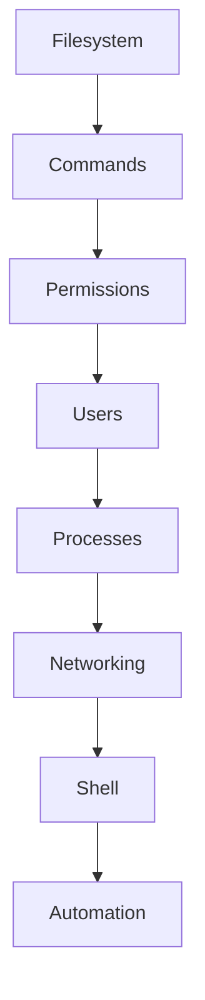

# 🐧 Linux for DevOps

Linux is the foundation of modern DevOps.

Almost every cloud server, Kubernetes node, Docker container, and CI/CD runner runs Linux.

Understanding Linux is one of the most important skills for every DevOps engineer.

---

# 📚 Topics Covered

| Topic | Description |
|---------|------------|
| Filesystem | Linux directory structure |
| File Management | Create, copy, move, delete files |
| Permissions | chmod, chown, chgrp |
| Users & Groups | User management |
| Process Management | ps, top, kill, jobs |
| Networking | ping, curl, ssh, netstat, ip |
| Text Processing | grep, awk, sed, cut |
| Shell Environment | PATH, variables |
| Package Management | apt, yum, dnf |

---

# Learning Flow



---

# Prerequisites

- Basic Computer Knowledge
- Terminal Access
- Ubuntu / Debian / macOS

---

# Goal

After completing this section you should be able to

- Navigate Linux confidently
- Manage files
- Understand permissions
- Troubleshoot services
- Debug networking issues
- Write basic automation scripts# 🐧 Linux for DevOps

> **Master Linux from scratch to an industry-ready level for DevOps, Cloud, SRE, and Platform Engineering.**

Linux is the foundation of modern DevOps. Almost every cloud server, Docker container, Kubernetes node, CI/CD runner, and production application runs on Linux.

Understanding Linux is one of the most important skills for every DevOps Engineer.

---

# 🎯 Learning Objectives

After completing this Linux module, you will be able to:

- Navigate the Linux filesystem confidently
- Work efficiently with files and directories
- Search and process data using Linux utilities
- Manage users, groups, and permissions
- Monitor and troubleshoot running processes
- Understand Linux networking fundamentals
- Configure and manage system services
- Automate repetitive tasks
- Debug common production issues
- Prepare for Linux & DevOps interviews

---

# 📚 Linux Course Roadmap

## Module 1 — Linux Fundamentals

Learn the basics of Linux and understand how the operating system works.

Topics Covered:

- What is Linux?
- History of Linux
- Linux Distributions
- Linux Architecture
- Kernel
- Shell
- Terminal
- Linux Boot Process
- File System Hierarchy Standard (FHS)

📄 File:

```text
01-linux-introduction.md
```

---

## Module 2 — Linux Filesystem

Learn how Linux organizes files and directories.

Topics Covered:

- Root Directory (/)
- Important Directories
- Absolute Path
- Relative Path
- Hidden Files
- Inodes
- Symbolic Links
- Hard Links

📄 File:

```text
02-linux-filesystem.md
```

---

## Module 3 — Navigation Commands

Learn how to move around the Linux filesystem.

Topics Covered:

- pwd
- ls
- cd
- tree
- stat
- realpath

📄 File:

```text
03-linux-navigation.md
```

---

## Module 4 — File Management

Learn how to create, copy, move, rename, and delete files.

Topics Covered:

- touch
- mkdir
- cp
- mv
- rm
- rmdir
- file

📄 File:

```text
04-linux-file-management.md
```

---

## Module 5 — File Searching

Learn how to locate files and directories quickly.

Topics Covered:

- find
- locate
- which
- whereis
- type

📄 File:

```text
05-linux-search.md
```

---

## Module 6 — Text Processing

Learn to process and manipulate text files.

Topics Covered:

- cat
- less
- more
- head
- tail
- grep
- cut
- sed
- awk
- sort
- uniq
- wc
- tee
- xargs

📄 File:

```text
06-linux-text-processing.md
```

---

## Module 7 — Shell Operators

Understand Linux operators used in the terminal.

Topics Covered:

- Pipes (`|`)
- Redirection (`>`, `>>`, `<`)
- Error Redirection (`2>`, `2>>`)
- `&&`
- `||`
- `;`
- Background (`&`)

📄 File:

```text
07-linux-shell-operators.md
```

---

## Module 8 — File Permissions

Learn Linux security and permission management.

Topics Covered:

- File Permissions
- chmod
- chown
- chgrp
- umask
- Numeric Permissions
- Symbolic Permissions

📄 File:

```text
08-linux-file-permissions.md
```

---

## Module 9 — Users & Groups

Learn Linux user management.

Topics Covered:

- User Accounts
- Groups
- useradd
- usermod
- userdel
- passwd
- sudo
- su

📄 File:

```text
09-linux-users-and-groups.md
```

---

## Module 10 — Process Management

Learn how Linux manages running applications.

Topics Covered:

- Processes
- Process States
- ps
- top
- htop
- kill
- killall
- jobs
- bg
- fg
- nice
- renice

📄 File:

```text
10-linux-process-management.md
```

---

## Module 11 — Networking

Learn essential Linux networking commands used in DevOps.

Topics Covered:

- ip
- ifconfig
- ping
- hostname
- nslookup
- dig
- curl
- wget
- ssh
- scp
- netstat
- ss
- traceroute
- lsof
- nc

📄 File:

```text
11-linux-networking.md
```

---

## Module 12 — Disk Management

Learn how Linux manages storage.

Topics Covered:

- df
- du
- mount
- umount
- lsblk
- fdisk

📄 File:

```text
12-linux-disk-management.md
```

---

## Module 13 — Environment Variables

Learn how Linux stores environment information.

Topics Covered:

- env
- printenv
- export
- PATH
- HOME
- SHELL
- USER
- PWD

📄 File:

```text
13-linux-environment-variables.md
```

---

## Module 14 — System Services

Learn how Linux manages services using systemd.

Topics Covered:

- systemctl
- journalctl
- Service Management
- Logs
- Boot Services

📄 File:

```text
14-linux-system-services.md
```

---

## Module 15 — Package Management

Learn how to install and update software.

Topics Covered:

- apt
- apt-get
- dpkg
- yum
- dnf
- rpm
- snap

📄 File:

```text
15-linux-package-management.md
```

---

## Module 16 — Task Scheduling

Learn how to automate recurring tasks.

Topics Covered:

- cron
- crontab
- at

📄 File:

```text
16-linux-task-scheduling.md
```

---

## Module 17 — Shell Utilities

Useful Linux utilities used daily by DevOps engineers.

Topics Covered:

- history
- alias
- clear
- echo
- printf
- date
- cal
- uname
- hostnamectl
- uptime

📄 File:

```text
17-linux-shell-utilities.md
```

---

## Module 18 — Linux Interview Preparation

Quick revision before interviews.

Topics Covered:

- Most Asked Linux Questions
- DevOps Interview Questions
- Scenario-Based Questions
- Command Cheat Sheet

📄 File:

```text
18-linux-interview-preparation.md
```

---

# 🛠 Prerequisites

Before starting this module, you should have:

- Basic Computer Knowledge
- A Linux Machine, Virtual Machine, WSL, or macOS Terminal
- Curiosity to explore the command line 😊

---

# 🧪 Hands-on Practice

Throughout this module, you'll practice:

- File management
- Server navigation
- Log analysis
- User management
- Process troubleshooting
- Networking
- Automation
- Production-like scenarios

---

# 🎯 Real-World DevOps Skills You'll Build

By the end of this module, you'll be able to:

- Connect to Linux servers using SSH
- Debug running applications
- Analyze logs
- Manage services
- Handle file permissions
- Monitor processes
- Troubleshoot networking issues
- Prepare servers for deployments

---

# 📌 Learning Tips

- Practice every command yourself.
- Don't just copy commands—understand what each option does.
- Read command documentation using `man`.
- Build small projects while learning.
- Repeat frequently used commands until they become muscle memory.

---

# 🚀 Next Step

Start your Linux journey with:

**📄 `01-linux-introduction.md`**

From there, continue through each module in order to build a strong foundation for DevOps, Cloud, and Site Reliability Engineering (SRE).
