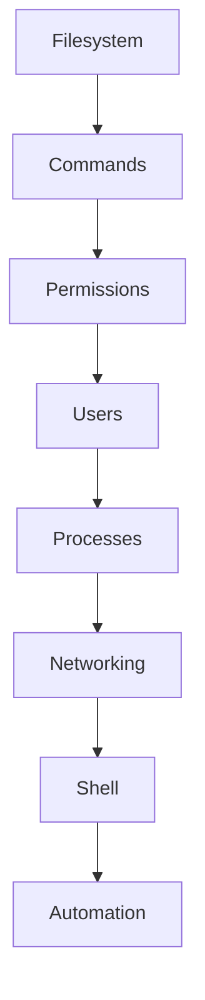

# 🐧 Linux for DevOps

Linux is the foundation of modern DevOps.

Almost every cloud server, Kubernetes node, Docker container, and CI/CD runner runs Linux.

Understanding Linux is one of the most important skills for every DevOps engineer.

---

# 📚 Topics Covered

| Topic | Description |
|---------|------------|
| Filesystem | Linux directory structure |
| File Management | Create, copy, move, delete files |
| Permissions | chmod, chown, chgrp |
| Users & Groups | User management |
| Process Management | ps, top, kill, jobs |
| Networking | ping, curl, ssh, netstat, ip |
| Text Processing | grep, awk, sed, cut |
| Shell Environment | PATH, variables |
| Package Management | apt, yum, dnf |

---

# Learning Flow

---

# Prerequisites

- Basic Computer Knowledge
- Terminal Access
- Ubuntu / Debian / macOS

---

# Goal

After completing this section you should be able to

- Navigate Linux confidently
- Manage files
- Understand permissions
- Troubleshoot services
- Debug networking issues
- Write basic automation scriptsDevOps Master Course

Module 1

Linux

✔ Introduction
✔ Filesystem
✔ Navigation
✔ File Management
✔ Search
✔ Text Processing
✔ Permissions
✔ Users & Groups
✔ Process Management
✔ Networking
✔ Package Management
✔ Cron
✔ SSH

Module 2

Shell Scripting

✔ Basics
✔ Variables
✔ Operators
✔ Input Output
✔ Conditions
✔ Loops
✔ Functions
✔ Arrays
✔ Script Arguments
✔ Debugging
✔ Real-world Scripts

Module 3

Git & GitHub

✔ Git Basics
✔ Repository
✔ Branching
✔ Merge
✔ Rebase
✔ Cherry Pick
✔ Stash
✔ GitHub Workflow
✔ Pull Requests
✔ GitHub Actions

Module 4

Docker

...

Module 5

Kubernetes

...

Module 6

AWS

✔ IAM
✔ EC2
✔ Security Groups
✔ VPC
✔ EBS
✔ ELB
✔ Auto Scaling
✔ S3
✔ CloudWatch
✔ Route53

Module 7

Terraform

...

Module 8

Jenkins

...

Module 9

Monitoring

✔ Prometheus
✔ Grafana

Module 10

SRE

✔ Incident Management
✔ SLA
✔ SLO
✔ SLI
✔ On-call
✔ Alerting
✔ Reliability
